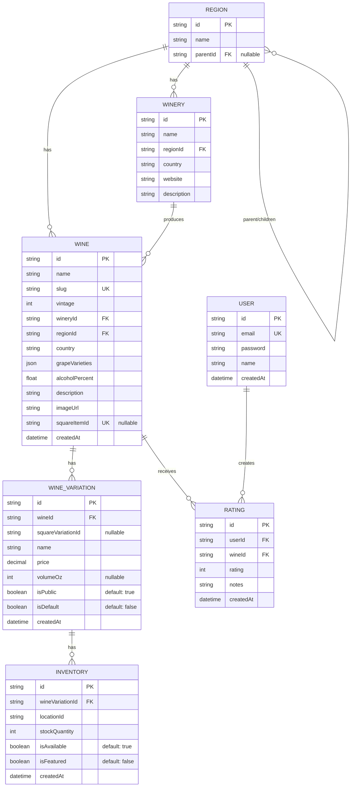

# Pourhouse Database Schema - Current State

## Overview

The Pourhouse database uses PostgreSQL with Prisma ORM. The schema supports:
- Wine catalog management with regional hierarchy
- Wine variations (different bottle sizes/formats)
- Inventory tracking by location
- User ratings and reviews
- Square catalog integration via ID references

---

## Entity Relationship Diagram



---

## Model Descriptions

### **Wine**
Core wine product catalog.

| Field | Type | Constraints | Notes |
|-------|------|-------------|-------|
| id | UUID | PK | Auto-generated |
| name | String | Required | |
| slug | String | UK | URL-friendly identifier |
| vintage | Int | Required | Year produced |
| wineryId | UUID | FK → Winery | Restrict delete |
| regionId | UUID | FK → Region | Restrict delete |
| country | String | Required | Originally hardcoded "Unknown" from Square sync |
| grapeVarieties | JSON | Required | Array of grape names |
| alcoholPercent | Float | Required | ABV; hardcoded 0 from Square sync |
| description | String | Required | Long-form text |
| imageUrl | String | Required | Hardcoded placeholder from Square sync |
| squareItemId | UUID | UK, Nullable | Links to Square CatalogObject |
| createdAt | DateTime | Required | System-generated |

**Indexes:**
- Unique: (name, wineryId, vintage)
- Index: regionId, wineryId

**Relationships:**
- `1:N` with WineVariation (cascade delete)
- `1:N` with Rating (cascade delete)
- `N:1` with Winery (restrict delete)
- `N:1` with Region (restrict delete)

---

### **WineVariation**
Represents different serving formats/sizes of a wine (e.g., 2oz glass, 5oz glass, 9oz bottle).

| Field | Type | Constraints | Notes |
|-------|------|-------------|-------|
| id | UUID | PK | Auto-generated |
| wineId | UUID | FK → Wine | Cascade delete |
| squareVariationId | UUID | Nullable | Links to Square ItemVariation |
| name | String | Required | e.g., "2oz", "5oz", "9oz" |
| price | Decimal(10,2) | Required | USD/Eur amount |
| volumeOz | Int | Nullable | Parsed from name |
| isPublic | Boolean | Default: true | 2oz variations = false (internal) |
| isDefault | Boolean | Default: false | 9oz variations = true |
| createdAt | DateTime | Required | System-generated |

**Indexes:**
- Index: wineId, squareVariationId

**Relationships:**
- `N:1` with Wine (cascade delete)
- `1:N` with Inventory (cascade delete)

**Square Sync Notes:**
- Deleted & recreated on every sync (destructive)
- 2oz variations marked `isPublic: false`
- 9oz variations marked `isDefault: true`

---

### **Winery**
Wine producer entity.

| Field | Type | Constraints | Notes |
|-------|------|-------------|-------|
| id | UUID | PK | Auto-generated |
| name | String | Required | Producer name |
| regionId | UUID | FK → Region | Restrict delete |
| country | String | Required | Country of origin |
| website | String | Required | |
| description | String | Required | Long-form text |

**Indexes:**
- Index: regionId

**Relationships:**
- `N:1` with Region (restrict delete)
- `1:N` with Wine

---

### **Region**
Geographic regions with hierarchical parent-child structure.

| Field | Type | Constraints | Notes |
|-------|------|-------------|-------|
| id | UUID | PK | Auto-generated |
| name | String | Required | Region name (e.g., "Napa Valley", "Bordeaux") |
| parentId | UUID | FK → Region, Nullable | Set null on parent delete |

**Indexes:**
- Index: parentId

**Relationships:**
- `N:1` with Region (self-referential, set null on delete)
- `1:N` with Region (self-referential children)
- `1:N` with Wine
- `1:N` with Winery

---

### **Inventory**
Stock and availability tracking by location.

| Field | Type | Constraints | Notes |
|-------|------|-------------|-------|
| id | UUID | PK | Auto-generated |
| wineVariationId | UUID | FK → WineVariation | Cascade delete |
| locationId | String | Required | Location code; "square:" prefix for Square locations |
| stockQuantity | Int | Required | Number of units; hardcoded 0 from Square |
| isAvailable | Boolean | Default: true | Mapped from Square variation.isDeleted |
| isFeatured | Boolean | Default: false | Hardcoded false from Square |
| createdAt | DateTime | Required | System-generated |

**Indexes:**
- Unique: (wineVariationId, locationId)
- Index: wineVariationId

**Relationships:**
- `N:1` with WineVariation (cascade delete)

---

### **User**
Authentication and rating user entity.

| Field | Type | Constraints | Notes |
|-------|------|-------------|-------|
| id | UUID | PK | Auto-generated |
| email | String | UK | Login identifier |
| password | String | Required | Hashed password |
| name | String | Required | Display name |
| createdAt | DateTime | Required | System-generated |

**Relationships:**
- `1:N` with Rating (cascade delete)

---

### **Rating**
User-submitted wine ratings and reviews.

| Field | Type | Constraints | Notes |
|-------|------|-------------|-------|
| id | UUID | PK | Auto-generated |
| userId | UUID | FK → User | Cascade delete |
| wineId | UUID | FK → Wine | Cascade delete |
| rating | Int | Required | 1-5 stars |
| notes | String | Required | User review text |
| createdAt | DateTime | Required | System-generated |

**Indexes:**
- Index: wineId, userId

**Relationships:**
- `N:1` with User (cascade delete)
- `N:1` with Wine (cascade delete)

---

## Square Integration Points

The schema maintains references to Square data via:

1. **Wine.squareItemId** (unique)
   - Links Wine record to Square CatalogObject
   - Used to identify wines for update vs. create during sync

2. **WineVariation.squareVariationId**
   - Links WineVariation to Square ItemVariation
   - Null for manually-created variations

3. **Inventory.locationId**
   - Prefixed with "square:" for Square-managed locations
   - Distinguishes Square locations from manual entries

---

## Current Sync Behavior (Issue #14 Context)

**Problem:** All fields are overwritten during sync, destroying manual edits.

**Current Destructive Flow:**
```
Square Sync Triggered
├─ Find Wine by squareItemId
├─ UPDATE Wine: name, description, country, imageUrl, etc. (ALL OVERWRITTEN)
└─ For each Wine:
   ├─ DELETE ALL WineVariations
   ├─ DELETE ALL Inventory rows
   └─ CREATE fresh WineVariations + Inventory from Square data
```

**Fields at Risk of Loss:**
- Wine.description (manually edited version lost)
- Wine.country (manual override lost)
- Wine.vintage (manual correction lost)
- Any WineVariation edits (all deleted and recreated)

---

## Design Constraints

- **Deletion Policy:** Cascade for content (Wine→Variation), Restrict for masters (Wine→Winery)
- **Square Import:** Uses placeholder Winery/Region with hardcoded UUIDs
- **Validation:** No current field-level validation for Square-owned vs. manual fields
- **Audit Trail:** No tracking of data origin or sync history

