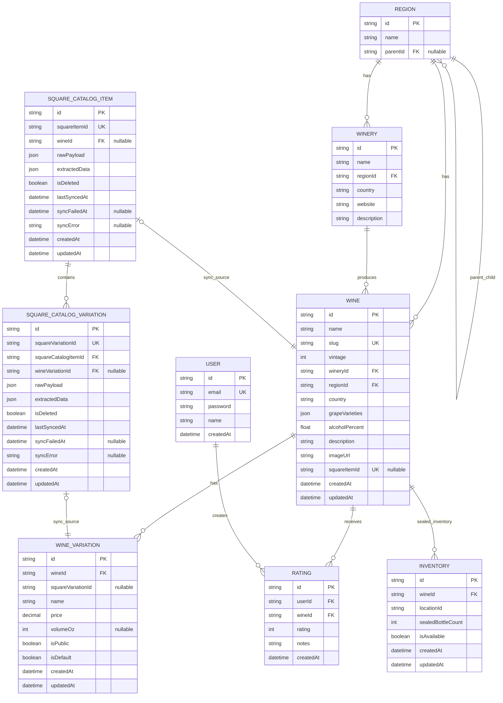

# Target Schema After Issue #14

## Purpose

This document defines the target database schema at the end of Issue #14:
- Separate Square sync data from manually managed wine data
- Protect manual edits from Square overwrite behavior
- Treat sealed, full bottles as the authoritative inventory count
- Do not track bottle depletion in this schema

## Scope Boundaries

In scope for this target schema:
- Square sync separation and ownership boundaries
- Sync-safe persistence of Square raw/extracted data
- Manual field preservation on Wine
- Sealed bottle inventory model

Out of scope for this target schema:
- Open bottle depletion tracking
- Flight composition modeling
- Public website contract redesign
- Serving mode redesign beyond current variation representation

Related follow-up issues:
- Issue #40: Serving modes model
- Issue #41: Flight composition and association
- Issue #42: Public availability flags API

---

## Field Ownership Model

### Square-managed fields
- Wine.squareItemId
- WineVariation.squareVariationId
- SquareCatalogItem raw and extracted payload fields
- SquareCatalogVariation raw and extracted payload fields

### Manual-managed fields
- Wine.description
- Wine.regionId
- Wine.country
- Wine.grapeVarieties
- Wine.alcoholPercent
- Wine.imageUrl
- Winery and Region editorial data

### Inventory policy
- Inventory tracks sealed bottle counts only
- Open bottles are not modeled
- No pour-level depletion is recorded

---

## Target ERD

---

## Schema Changes From Current State

1. Add Square persistence tables:
- SquareCatalogItem
- SquareCatalogVariation

2. Re-anchor inventory to Wine (sealed bottles):
- Inventory.wineId foreign key replaces Inventory.wineVariationId
- Inventory.sealedBottleCount replaces stockQuantity for this domain model
- Unique index on Inventory(wineId, locationId)

3. Keep Wine and WineVariation for compatibility while separating data ownership:
- Wine stores manual-facing business data
- WineVariation remains current service representation until Issue #40
- Square tables become source-of-truth for sync payloads and auditability

4. Add sync observability fields in Square tables:
- lastSyncedAt
- syncFailedAt
- syncError

---

## Sync Rules Implied By This Schema

1. Sync writes raw payloads to SquareCatalogItem and SquareCatalogVariation first.
2. Sync maps Square-owned fields to Wine and WineVariation only where ownership allows.
3. Manual-managed fields on Wine are never overwritten by sync.
4. Inventory updates only sealed bottle counts by wine and location.
5. Deletion in Square marks source records as deleted but should not blindly destroy manual data.

---

## Notes For Implementation Planning

- This target schema is intentionally conservative for Issue #14.
- Serving model changes are deferred to Issue #40.
- Flight support remains deferred to Issue #41.
- Public API availability contract changes remain deferred to Issue #42.
