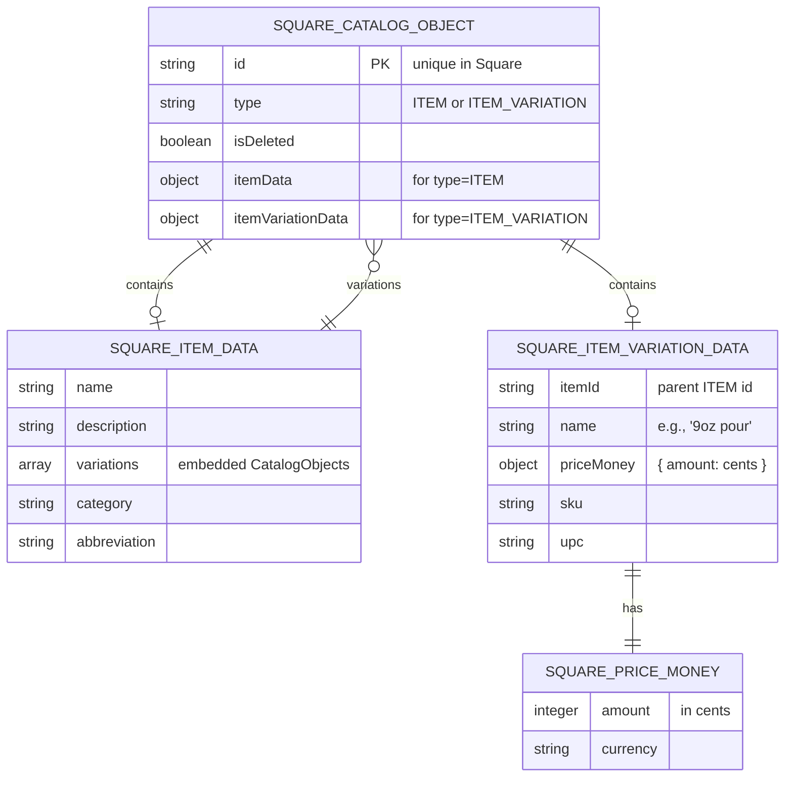
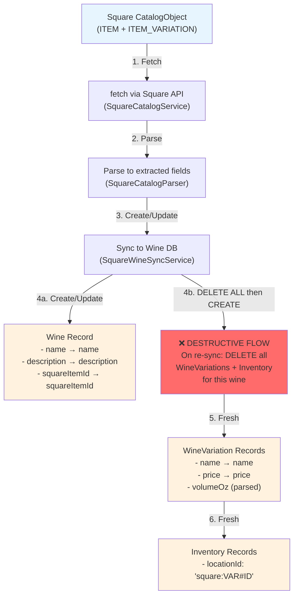
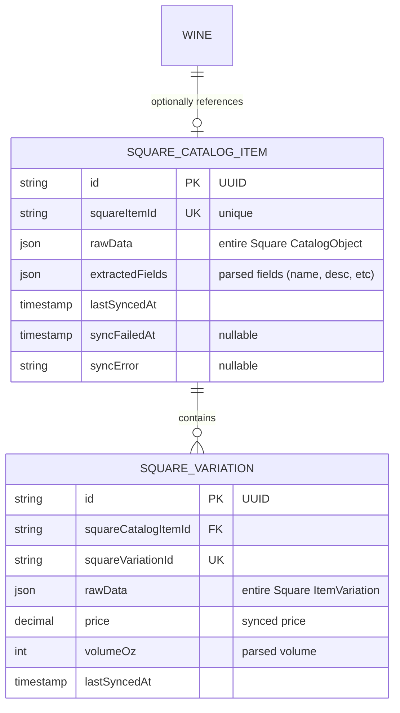
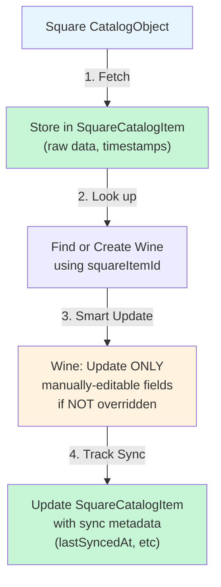

# Square Data Structure & Integration Model

## Document Status

- This document combines historical context and design notes from Issue #14.
- Parts labeled as "proposed" are architectural reference, not guaranteed current behavior.
- For operational embed setup and production configuration, use `docs/squarespace-integration.md`.

## Overview

Square provides catalog data via the Catalog API. This document outlines:
1. Square's native data structure (CatalogObject hierarchy)
2. How it currently maps (destructively) to Wine/WineVariation/Inventory
3. A proposed separate staging model for Issue #14

---

## Square API Data Structure

### Square CatalogObject Hierarchy



### Square CatalogObject Example: Multi-Pour Wine

```json
{
  "id": "ITEM#WINE123",
  "type": "ITEM",
  "isDeleted": false,
  "itemData": {
    "name": "Pinot Noir 2019",
    "description": "Oregon wine",
    "variations": [
      {
        "id": "VAR#2OZ",
        "type": "ITEM_VARIATION",
        "itemVariationData": {
          "itemId": "ITEM#WINE123",
          "name": "2oz pour",
          "priceMoney": { "amount": 1200, "currency": "USD" }
        }
      },
      {
        "id": "VAR#5OZ",
        "type": "ITEM_VARIATION",
        "itemVariationData": {
          "itemId": "ITEM#WINE123",
          "name": "5oz pour",
          "priceMoney": { "amount": 2500, "currency": "USD" }
        }
      },
      {
        "id": "VAR#9OZ",
        "type": "ITEM_VARIATION",
        "itemVariationData": {
          "itemId": "ITEM#WINE123",
          "name": "9oz pour",
          "priceMoney": { "amount": 4500, "currency": "USD" }
        }
      }
    ]
  }
}
```

---

## Current Data Flow (Destructive)



### Current Mapping: Square Fields → Internal Models

#### **ITEM CatalogObject → Wine Model**

| Square Field | → | Internal Field | Transformation | Risk |
|---|---|---|---|---|
| `CatalogObject.id` | → | `Wine.squareItemId` | Direct copy | **Unique identifier lost if overwritten** |
| `itemData.name` | → | `Wine.name` | Direct copy | ⚠️ **Overwrites manual edits** |
| `itemData.description` | → | `Wine.description` | Direct copy or "Imported..." | ⚠️ **Overwrites manual edits** |
| *(generated)* | → | `Wine.slug` | `${name}-${squareItemId.hash}` | Regenerated each sync |
| *(generated)* | → | `Wine.vintage` | Deterministic hash of squareItemId | Artificial data |
| *(hardcoded)* | → | `Wine.country` | `"Unknown"` | ⚠️ **Manual overrides lost** |
| *(hardcoded)* | → | `Wine.grapeVarieties` | `[]` (empty) | ⚠️ **Manual edits lost** |
| *(hardcoded)* | → | `Wine.alcoholPercent` | `0` | ⚠️ **Manual edits lost** |
| *(hardcoded)* | → | `Wine.imageUrl` | Placeholder URL | ⚠️ **Manual edits lost** |
| *(ignored)* | — | — | Category, abbreviation, tax data | Data ignored |

#### **ITEM_VARIATION CatalogObject → WineVariation Model**

| Square Field | → | Internal Field | Transformation | Risk |
|---|---|---|---|---|
| `CatalogObject.id` / `itemVariationData.id` | → | `WineVariation.squareVariationId` | Direct copy | **Unique identifier** |
| `itemVariationData.name` | → | `WineVariation.name` | Direct copy | Sync-driven |
| `itemVariationData.priceMoney.amount` | → | `WineVariation.price` | Divide by 100 (cents→$) | Sync-driven |
| *(parsed from name)* | → | `WineVariation.volumeOz` | Regex: `(\d+)\s*oz` | ⚠️ **Parsing logic dependency** |
| `volumeOz === 2` | → | `WineVariation.isPublic` | Set false | ⚠️ **Logic-driven, not data-driven** |
| `volumeOz === 9` | → | `WineVariation.isDefault` | Set true | ⚠️ **Logic-driven, not data-driven** |

#### **WineVariation → Inventory Model**

| Source | → | Inventory Field | Value | Note |
|---|---|---|---|---|
| `WineVariation.id` | → | `Inventory.wineVariationId` | FK | |
| *(generated)* | → | `Inventory.locationId` | `square:${variationId}` | Signals Square origin |
| *(hardcoded)* | → | `Inventory.stockQuantity` | `0` | Stock must be managed separately |
| `variation.isDeleted` | → | `Inventory.isAvailable` | `!isDeleted` | Inverted mapping |
| *(hardcoded)* | → | `Inventory.isFeatured` | `false` | |

---

## Fields Extracted vs. Ignored from Square

### ✅ Currently Extracted (Stored in Wine/WineVariation)
- Item ID
- Item name
- Item description
- Variation ID
- Variation name
- Variation price
- Deletion status

### ❌ Currently Ignored (Lost)
- Item category
- Item abbreviation
- Variation SKU
- Variation UPC
- Item images
- Tax data
- Modifiers
- Custom attributes
- Catalog version (no change tracking)
- Update timestamps

---

## Proposed: Separate Staging Table Architecture

To solve Issue #14 (prevent data loss during sync), we propose a **separate `SquareCatalogItem` staging table**:

### New Schema Addition



### Proposed Data Flow



### Key Benefits

| Benefit | How |
|---|---|
| **Audit Trail** | SquareCatalogItem stores full raw data + sync metadata |
| **Rollback** | Can regenerate Wine/WineVariation from SquareCatalogItem historical data |
| **Selective Sync** | Choose which fields get "synced over" vs. protected |
| **Change Detection** | Can compare Square data versions between syncs |
| **Manual Override Tracking** | Can mark which Wine fields were manually edited |
| **No Destructive Deletes** | WineVariation records preserved even if removed from Square |

### Data Separation

#### **Square-Managed Data** (stored in SquareCatalogItem)
- All raw data from Square
- Historical versions
- Sync timestamps and errors
- Extracted fields (name, description, price, etc.)

#### **Manual-Editable Data** (stays in Wine)
- Country
- Grape varieties
- Alcohol percent
- Region (if user wants to correct it)
- Description (if user wants to enhance it)
- Images (if user provides better ones)

#### **Auto-Derived Data** (generated, not synced)
- Slug (from name)
- Vintage (generated from hash)
- isPublic (derived from volumeOz)
- isDefault (derived from volumeOz vs. variation list)

---

## Current Destructive Problem Example

### Scenario: Sync Overwrites Manual Edits

**Before Sync:**
```
Wine {
  id: wine-123
  squareItemId: ITEM#ABC
  name: "Pinot Noir 2019"
  description: "Oregon wine [MANUALLY ENHANCED: Complex berry notes]"
  country: "USA"  [MANUALLY SET]
  grapeVarieties: ["Pinot Noir"]  [MANUALLY ADDED]
}
```

**Square Currently Has:**
```
{
  id: "ITEM#ABC",
  itemData: {
    name: "Pinot Noir 2019",
    description: "Oregon wine"
  }
}
```

**After Current Sync (Destructive):**
```
Wine {
  id: wine-123
  squareItemId: ITEM#ABC
  name: "Pinot Noir 2019"
  description: "Oregon wine"  ← LOST: "[MANUALLY ENHANCED...]"
  country: "Unknown"  ← LOST: "USA"
  grapeVarieties: []  ← LOST: ["Pinot Noir"]
}
```

**After Proposed Sync (Protected):**
```
Wine {
  id: wine-123
  squareItemId: ITEM#ABC
  name: "Pinot Noir 2019"  ← From Square (can auto-sync)
  description: "Oregon wine [MANUALLY ENHANCED: Complex berry notes]"  ← PRESERVED
  country: "USA"  ← PRESERVED
  grapeVarieties: ["Pinot Noir"]  ← PRESERVED
  lastSquareSyncAt: 2026-03-23T10:30:00Z  ← NEW TRACKING
}

SquareCatalogItem {
  squareItemId: "ITEM#ABC"
  rawData: { entire Square CatalogObject }
  lastSyncedAt: 2026-03-23T10:30:00Z
  extractedFields: {
    name: "Pinot Noir 2019",
    description: "Oregon wine",
    variations: [...]
  }
}
```

---

## Next Steps for Issue #14

1. **Decision:** Confirm staging table approach (SquareCatalogItem + SquareVariation tables)
2. **Schema Migration:** Add new tables with foreign keys to Wine (optional)
3. **Data Strategy:** Define which Wine fields are sync-safe vs. protected
4. **Sync Logic:** Refactor SquareWineSyncService to use staging tables
5. **Idempotency:** Add change detection to avoid unnecessary updates
6. **Testing:** Verify manual edits survive re-sync cycles

